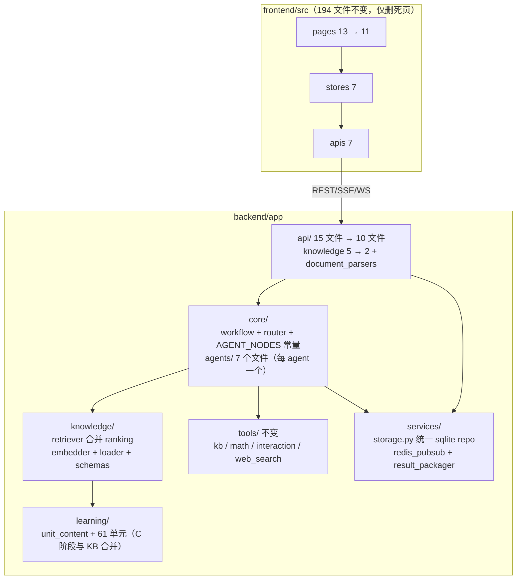

# 架构全面审查与简化评估

> 日期: 2026-09 | 审查方式: 全量源码通读 + git 台账 + 实测测试 | 审查人: Agent（哲）
> 结论: **可以简化，且收益大；但不建议推倒重建。** 推荐「先收敛结构（方案 B），再评估域合并（方案 C）」。

---

## 一、现状实测数据

| 维度 | 实测值 |
|------|--------|
| git 跟踪文件 | 607 |
| 后端代码 | 82 个 py 文件 / 15,504 行（`backend/app`） |
| 前端代码 | 194 个 ts/vue 文件 / 14,953 行（`frontend/src`） |
| API 路由 | 88 个，分散在 15 个路由文件（knowledge 独占 5 文件 34 路由） |
| LangGraph | 11 节点（7 个 agent 节点），`nodes.py` 单文件 1,900 行 |
| services 层 | 12 个类：Session / SqliteSession / Learning / Practice / Achievement / WorkingMemory / EpisodicMemory / ResultPackager / KBExtractor / Redis×2 |
| 检索栈 | 9 个文件 1,971 行（retriever 683 + embedder 447 + chain 138 + reranker 141 + ranking 154 + loader 145 + schemas 119 + expander 59 + indexer 85） |
| 内容双轨 | 学习单元 61 个 md（`learning/content`） vs 方法卡片 47 张 YAML（`knowledge_base/methods`）——**同一批方法（LP/IP/AHP/TOPSIS/灰色预测…）两套内容、两条读取路径** |
| 根目录 | 13 个 md + 6 个启停脚本 + 2 个 compose + nginx.conf + 2 个运行日志 |
| 依赖 | 后端 36 个直接依赖（含 OCR 三件套 rapidocr/pytesseract/pdf2image）；前端 29 个 |
| 测试 | 18 个测试文件，重跑全过；1 条 flaky（沙箱超时回传 partial stdout，Windows 杀进程树竞态） |
| 历史审查 | `.mstar/plans/audit-2026-08-14` 30 项（安全 8 / bug 10 / perf 5 / 其他 7），安全项多数已修 |

**已经做对的部分（简化时要保住，别误伤）：**
- LLM 抽象统一：16 个调用点全部走 `LLMFactory`，无第二套 client 封装。
- 仓库卫生干净：无二进制/日志/node_modules 入库，`backend/data/` 已 ignore，git status 干净。
- 安全修复到位：路径校验、OAuth state、DOMPurify、SSRF 校验、沙箱双后端。
- 单 LLM 供应商配置按 agent 角色走 settings，无散落硬编码。

---

## 二、问题分级

### P0 — 真重复 / 真漂移（优先处理）

1. **两套教学内容**：61 个学习单元 md 与 47 张方法卡片 YAML 主题大面积重叠，双份维护、双份更新，检索还各走各的（learning 直接查、knowledge 走向量+BM25+RRF+MMR）。
2. **文档层漂移**：根目录 13 个 md 互相矛盾——PLAN.md 写「5 个 Agent」实际 7 个；写 `/teach` 页面 ✅ 实际无此路由；API 表缺 learning/profile/session/export 四组共 30+ 路由；RULES 说 ARCHITECTURE.md 废弃但 README 仍引用。PLAN_V2 / NEXT_DEV_PLAN / LEARNING_PLAN / IMPROVEMENT_PLAN / RESOURCES_AND_ROADMAP / AUDIT_REPORT / MEMORY_CONTEXT_GUIDE / DEPLOY_CLOUD 八个文档没有权威标识，新人无法判断以谁为准。
3. **启停脚本 6 个**：install.bat / install.py / install.sh / start.bat / start.py / stop.bat——三套操作系统各写一遍，逻辑漂移风险（历史审查 #28 已抓到 start.py 端口硬编码、stop.bat 容器名不对）。
4. **路由表字面重复**：`router.py` 里 7 条 `node_map` 抄了 3 遍，`workflow.py` 里 7 节点清单抄了 2 遍——加一个 agent 要改 5 处。
5. **knowledge 路由 5 文件**：`knowledge_search_routes.py` 997 行里塞着 400 行 PDF/OCR/Excel/DOCX 解析（`_ocr_pdf_text`/`_extract_pdf_text`/`_parse_excel`…），职责错位。

### P1 — 结构可收敛

6. **services 存储并行**：SessionManager(JSON) + SqliteSessionStore + LearningStore + PracticeStore + AchievementService + WorkingMemory + EpisodicMemory——7 套持久化概念，实际可收敛为「一个 sqlite repo 层 + 3 个库（session / learning / practice）」。
7. **nodes.py 1,900 行**：12 个节点函数堆在一个文件，`solving_agent_node` 单函数约 400 行；PLAN 原设计有 `core/agents/` 目录但从未使用。
8. **检索栈 9 文件**：ranking/reranker/query_expander 三个排序模块职责交叠；每次检索额外 3 次 LLM 调用（历史审查 #22，未加缓存）。

### P2 — 清理项

9. **死代码**：`pages/example/[id].vue` 是 0 行空文件且未注册路由；PLAN 里的 `/archive/:id`、`/teach` 页面不存在。
10. **依赖瘦身**：OCR 三件套 + duckduckgo 可降为 optional extras，核心安装体积能砍一半以上。
11. **部署配置分裂**：docker-compose.yml / docker-compose.cloud.yml / nginx.conf（compose 未挂载，孤儿）三份并存，端口口径不一（5174/80/8000/8002）。
12. **flaky 测试**：`test_subprocess_timeout_returns_partial_stdout` 首跑失败、重跑通过——杀进程树后二次 `communicate(timeout=5)` 的竞态。

---

## 三、简化方案（三条路线）

### 方案 A — 只统一文档与入口（0.5 天，零风险）

- 根目录只留 `README.md`（门面）/ `RULES.md`（红线）/ `PLAN.md`（计划），其余 10 个 md 移入 `docs/` 并按「现行 / 历史存档」两级命名。
- 启停统一为 `start.py` 单入口（install/start/stop 三个子命令，跨平台），删掉 5 个 bat/sh 变体。
- 删死页面文件，PLAN.md 的页面清单与 API 表校正到与代码一致。

### 方案 B — A + 结构收敛（3–5 天，中风险，**推荐**）

- `nodes.py` 按 agent 拆到 `core/agents/<name>.py`（每文件 100–250 行），nodes.py 只留注册表。
- `node_map` 提为模块级常量 `AGENT_NODES`，router/workflow 共用，加 agent 只改一处。
- services 收敛为 `services/storage.py`（sqlite repo：连接管理 + 通用 CRUD）+ 3 个库定义；WorkingMemory/EpisodicMemory 并入 session 库的两张表。
- knowledge 路由合并为 `knowledge_routes.py`（CRUD）+ `knowledge_search_routes.py`（检索）；PDF/OCR/Excel/DOCX 解析抽到 `services/document_parsers.py`。
- 检索栈合并：ranking 合入 retriever，reranker/query_expander 改为可插拔 + 结果缓存。

### 方案 C — B + 域合并（2–3 周，高风险）

- 学习单元与方法卡片合并为**单一知识模型**：YAML 真源（卡片）+ md 长文作为卡片的 `content` 字段，学/做/查共用一套索引与一条检索路径。
- 影响面：chroma 索引重建、61 单元 + 47 卡片的交叉引用、learning/knowledge 两侧 API 合并。**收益是消掉最大的一块重复（双份内容维护），但动作大，建议 B 稳住之后单独评估。**

---

## 四、推荐路径与理由

**先 B 后评估 C，不推倒重建。**

- 推倒会丢掉的已到位资产：LLMFactory 统一封装、安全修复（8 项历史高危多数已修）、18 个测试文件、607 文件的 git 历史。这些是净增值，不是负担。
- B 不动数据模型、不动 API 契约、不动内容文件，纯结构收敛，每步可独立提交 + 跑测试验证。
- C 是唯一能根治「双轨内容」的路线，但应该等内容合并方案（卡片即单元 vs 单元即卡片）想清楚再动，且必须配索引迁移脚本。

### 目标结构（B 之后）

---

## 五、验证记录（本次审查实测）

- `pytest backend\tests`：18 个测试文件，重跑 **全部通过**；首跑 1 条 flaky（`test_subprocess_timeout_returns_partial_stdout`，Windows 杀树竞态，建议修：`_kill_tree` 后等孙子进程退出再 `communicate`）。
- `git status`：干净，无未提交改动。
- `git ls-files`：607 文件；无 `.log`/二进制/`node_modules`/`data/` 入库（仓库卫生良好）。
- LLM 调用点 16 处全部经 `LLMFactory`，无重复封装。

---

## 六、执行记录（2026-09，审查后按顺序实施完成）

13 个提交，每步独立验证（pytest / ruff / vue-tsc / biome 全绿后提交）。

### 优化项 ①–⑥（性能与正确性）

| # | 提交 | 内容 | 实测效果 |
|---|------|------|---------|
| ① | `d8813ee` | kb_tools.get_retriever 复用共享单例，修掉 import 后 chat 路径 BM25 不失效的 bug；顺带发现并修 `.gitignore` 裸 `tools/` 误伤 `backend/app/tools/`（`ce5dca0`） | 双份 BM25/Chroma → 单份；新卡片即时可见 |
| ② | `b50d1ea` | 会话同步改懒加载：只预载最近 3 个会话消息，切换时按需拉 | 进页面最坏 240+ 串行请求 → 4 模式各 4 个并行 |
| ③ | `6f089fc` | `/api/knowledge/search` 加 LRU+TTL 结果缓存，挂到 invalidate 钩子 | 重复查询跳过 3 次 LLM 调用 |
| ④ | `80461ec` | MMR 按需算 query 向量；`_embed_query` 实例级 TTL 缓存 | 无文档向量时省 1 次 embedding API 调用 |
| ⑤ | `52abe3f` | 检索链路 6 处静默 `except: pass` 改 logger.warning | 「搜不到」可区分「真没有」与「检索坏了」 |
| ⑥ | `9ffa175` | 沙箱包装器 matplotlib 改按需配置（meta_path hook 只拦 pyplot） | 每次执行 1.1–1.4s → 0.39s；flaky 测试连跑 5 次全过 |

### 方案 A（文档与入口统一）

- `757f8c2`：根目录 13 md → 3 权威 + `docs/`（现行 5 篇 + archive 6 篇 + 索引）；启停 6 脚本 → `start.py`（install/start/stop 子命令，跨平台）+ `start.bat` 纯 ASCII 转发器；合并时对齐了两份旧安装脚本的 `.env` 替换差异。
- `8254f10`：删除死页面 `example/[id].vue`（218 行、无路由无接口）；PLAN.md 全面校正（5→7 agent、图拓扑、AgentState、Tool 表、页面清单、API 表）。

### 方案 B（结构收敛）

- `d004dbc`：node_map 3 份手抄 + 节点清单 2 份 → `AGENT_NODES` 单一真源 + 不变量测试。
- `1b88977`：`nodes.py` 1900 行 → 505 行，7 个 agent 节点拆到 `core/agents/`（79–409 行/文件），import 路径全兼容。
- `1921cec`：三个 SQLite store 的连接样板收敛到 `services/storage.py` 的 `SqliteRepo` 基类（含 `_migrate`/`_post_init` 钩子与共用 `utcnow`）。
- `60993ab`：270 行文件解析器外移到 `services/document_parsers.py`，search 路由文件 1224 → 820 行，18 路由行为不变。

### 最终状态

- 后端 82 py / ~15.5k 行 → 89 py / ~16k 行（新增 4 个测试文件 + 3 个服务/agents 模块，测试 18 → 21 个文件全过）
- 测试：**22 个测试文件全部通过**（新增 19 个回归测试锁死本轮改动）；ruff / vue-tsc / biome 全绿
- 遗留（明确不做）：方案 C（学习单元与方法卡片内容模型合并）需先定「卡片即单元 vs 单元即卡片」，建议单独评估；WorkingMemory/EpisodicMemory 为文件检查点式存储，与 SQLite store 生命周期不同，维持现状

### 追加实施（2026-09 晚，真机验证通过后）

- **真机验证**：后端+前端实测全链路——搜索缓存 10.7s→5ms、会话懒加载、中文 UTF-8
  字节级往返、Vite 代理；发现并排除一个显示层误报（PowerShell 控制台编码）。
  唯一外部阻塞是失效的 API Key（用户已更新并确认功能测试通过）。
- `79e15e2` 依赖瘦身：核心 36→33，OCR/搜索降 extras（pytesseract/pdf2image 为死依赖移除，
  PyPDF2 补声明）；start.py / CI / README 同步。
- `14bb097` 提取流水线外移：`services/knowledge_ingest.py`（run_extraction + prompts +
  job store 访问器），`knowledge/kb_files.py`（4 个 KB 文件助手从 api 层下沉）；
  search 路由文件 1224 → 433 行；新增 6 个回归测试。
- `54553b9` 方案 C 设计对比文档：三个方向 + 三个决策点 + 工作量预估，
  见 [plan-c-content-merge.md](./plan-c-content-merge.md)。
- 遗留：docker-compose 两份合并需 Docker 环境验证（本机无 Docker），不做盲改。

### 方案 C 实施（2026-09，用户拍板方向 3）

- `d534743` 数据修复：8 张不同方法的卡片 id 全部撞成 mc_048（批量导入缺陷），
  重新分配 mc_090–mc_097。
- `90cb0f5` 读取路径：MethodCard 增加 `unit_id`/`content_md`；单元正文优先取
  卡片长文，回落 content 文件。
- `f625d02` 数据迁移：27 个 modeler 单元长文挂到对应卡片并删源文件（27 迁 /
  11 留，映射人工校正）；新增 `test_plan_c_migration.py` 五个不变量测试；
  旧「一单元一文件」测试不变量更新。
- `eac1426` content_md 纳入向量索引文本（前 3000 字符）；索引重建（247 文档）。
- `9322306` 卡片详情暴露 unit_id + 前端跳转 /learn/<unit_id>，双向可达闭环。
- 真机验证：迁移单元正文来自卡片、保留单元来自文件、quiz 按 unit 返回 3 题、
  搜索命中、卡片详情返回 unit_id。23 个测试文件全过。
- 完整映射表与决策记录：[plan-c-content-merge.md](./plan-c-content-merge.md)。

**至此审查报告 P0 级问题全部清零**；P1 剩余项（依赖/部署配置/前端测试）见上文。
